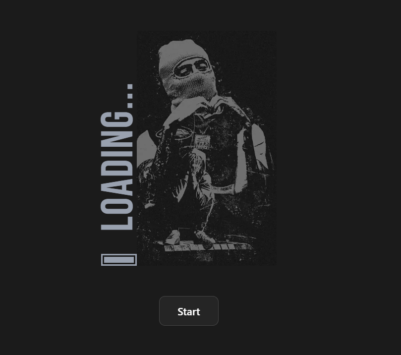
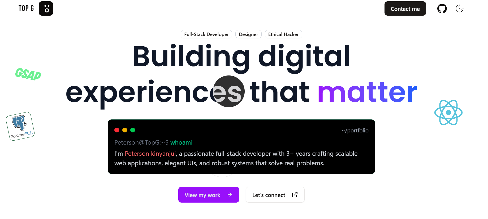
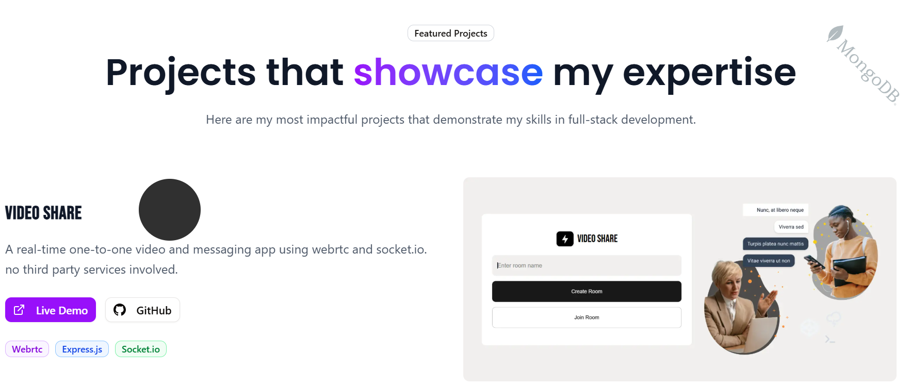
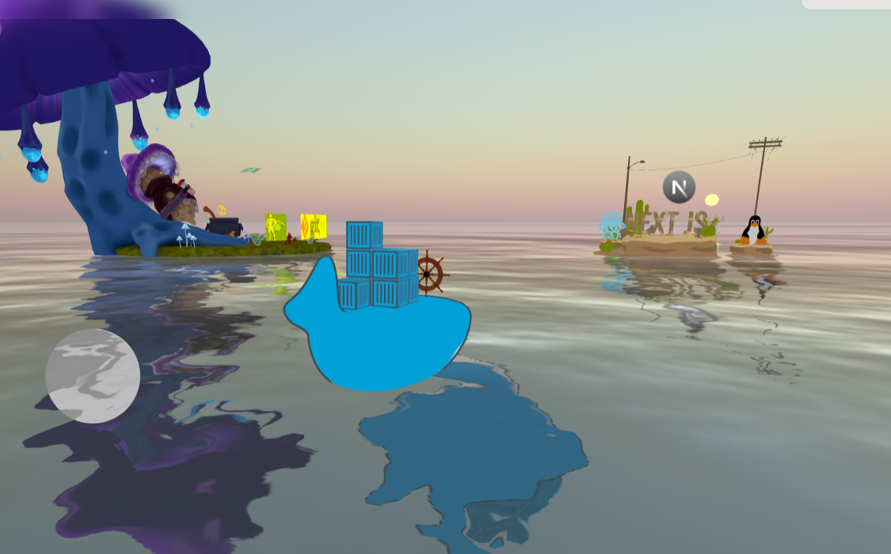

# My Portfolio

<div align="center">
  <table>
    <tr>
      <td width="50%">
        
      </td>
      <td width="50%">
        
      </td>
    </tr>
    <tr>
      <td width="50%">
        
      </td>
      <td width="50%">
        
      </td>
    </tr>
  </table>
</div>

---

## 🚀 Welcome to My Portfolio

A modern, responsive portfolio website built with Next.js, showcasing my projects, skills, and professional journey as a developer.

## ✨ Features

- **Responsive Design** - Optimized for all device sizes
- **Fast Performance** - Built with Next.js for optimal loading speeds
- **Modern UI/UX** - Clean and professional interface
- **Project Showcase** - Detailed project presentations with live demos
- **3D scenes** - display my skills in 3d

## 🛠️ Built With

- [Next.js](https://nextjs.org/) - React framework for production
- [Threejs](https://reactjs.org/) - JavaScript library for rendering 3d content on the web
- [TypeScript](https://www.typescriptlang.org/) - Typed JavaScript
- [Tailwind CSS](https://tailwindcss.com/) - Utility-first CSS framework
- [gsap](https://gsap.com/)
- [Vercel](https://vercel.com/) - Deployment platform

## 🏃‍♂️ Running Locally

1. Clone the repository:

   ```bash
   git clone https://github.com/Pkson13/portfolio.git
   ```

2. Install dependencies:

   ```bash
   npm install
   # or
   yarn install
   # or
   pnpm install
   ```

3. Run the development server:

   ```bash
   npm run dev
   # or
   yarn dev
   # or
   pnpm dev
   ```

4. Open [http://localhost:3000](http://localhost:3000) in your browser to see the result.

## 📂 Project Structure

```
├── components/          # Reusable UI components
├── pages/              # Next.js pages
│   ├── api/           # API routes
│   ├── _app.js        # App component
│   └── index.js       # Home page
├── public/            # Static assets
│   └── models/        # 3d assets
├── lib/               # Utility functions
└── README.md          # You are here
```

## 🚀 Deployment

The easiest way to deploy your Next.js app is to use the [Vercel Platform](https://vercel.com/new?utm_medium=default-template&filter=next.js&utm_source=create-next-app&utm_campaign=create-next-app-readme).

1. Push your code to GitHub
2. Connect your repository to Vercel
3. Deploy with one click

Check out the [Next.js deployment documentation](https://nextjs.org/docs/deployment) for more details.

⭐ **If you found this portfolio helpful, please give it a star!**
